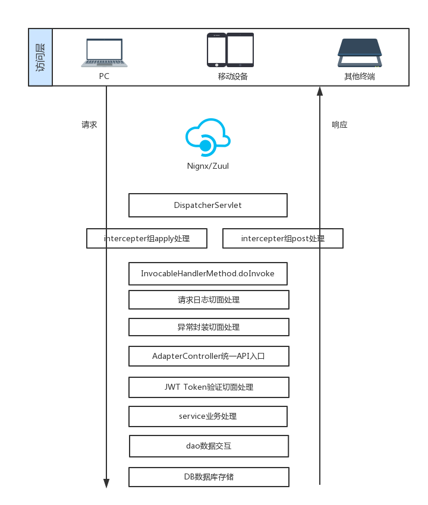

##### Api框架补充说明
ApiStarterApi 项目统一使用post请求访问接口,
使用AdapterController作为统一的api入口.
请求业务模块为service的类名,请求业务方法为service的方法名,
在AdapterController方法中,通过@PathVariable获取请求参数中的模块与业务方法,
通过ApplicationContext获取模块对象,使用反射method.invoke执行真正的调用方法.
在ResponseHandlerAspect与ApiRecordAspect两个切面中分别对请求结果包装以及请求访问日志记录,

在牺牲了一小部分反射带来的性能浪费的下,极大的简化了开发操作流程,使用户能够更快的进行服务端开发,专注业务实现.


#### 浏览器进程  

1. 输入内容并回车
2. 浏览器判断输入内容是检索词或是网址
   1. 检索词 	默认搜索引擎地址拼接上搜索词,形成url
   2. url 
3. 提交url给网络进程

#### 网络进程

1. 分别获取url中的域名与参数,封装http报文

   ```
   请求行
   请求头
   请求体
   
   示例:
   POST /user/list HTTP/1.1
   Host: localhost:8552
   cache-control: no-cache
   Content-Type: multipart/form-data;
   
   Content-Disposition: form-data; name="currentPage"
   ```

2. 根据域名获取ip

   1. 查看浏览器缓存
   2. 查看本机缓存
   3. 查看host配置映射
   4. 本机通过53端口发送请求给本机配置的DNS服务商
      1. DNS服务商自身缓存
      2. DNS服务商发送给跟ROOT服务商获取子服务商地址
      3. 请求子服务商,直到获取到ip
   
3. 使用socket.send(data,TCP/UDP)发送数据

4. 客户端使用操作系统随机分配的端口号(1000~65535)与服务器的IP+建立连接通道(默认为80)
    
    [TCP握手过程](tcp/index.md)

5. socket把http报文包装成tcp报文

6. 通过tcp链接发送TCP数据包至网卡

7. 网卡将数据推送至路由器

8. 路由器根据tcp数据包ip头信息发送至广域网

#### 服务器

1. [Nginx转发请求](./nginx/nginx.md)
    
2. tomcat接收处理请求

   1. 概览server->service->connector<->engine->host->context->web.xml->dispatchServlet->controller

   2. Coyote Connector监听到请求

   3. 创建新线程,分配此socket给HttpProcesser

   4. HttpProcesser,调用service方法

   5. setSocketWrapper(socketWrapper)中初始化inputBuffer/outputBuffer,读取数据包,解析Http协议的Line,Header,data数据

      1. 低版本BIO形式读取

      2. 高版本NIO形式读取数据

         1. io五大模型

         2. java bio nio aio基本理解

         3. netty IO零拷贝实现

            1. netty中的堆外直接内存

               绕过虚拟机直接send到SocketChannel

            2. 扩展 java中的MappedByteBuffer

               对大文件读写的优势

   6. service方法中获取CoyoteAdapter,并执行service

      1. 进行request/response对象包装
      2. 匹配Engine来处理，并等待来自Engine的回应

   7. StandardEngineValve->StandardHostValve->StandardContextValve

   8. host匹配Context(context就是一个application应用)

   9. context执行HttpServlet的service方法,根据web.xml配置匹配匹配Spring.FrameworkServlet,执行processRequest方法,最终执行DispatcherServlet.doService

#### DispatcherServlet分发处理请求

   1. DispatcherServlet收到请求后,作为统一访问点,委托给其他的解析器进行处理，进行全局的流程控制

   2. 如果是文件上传,再包装一下request

   3. getHandler确定当前请求的处理器HandlerExecutionChain(包含一个Handler处理器对象、多个HandlerInterceptor拦截器对象)

   4. getHandlerAdapter确定当前请求的处理程序适配器。

   5. 通过HandlerExecutionChain.applyPreHandle(processedRequest, response)方法,对请求进行intercepter拦截器组的前置处理

   6. HandlerAdapter.handle处理器功能处理方法的调用

      1.  RequestMappingHandlerAdapter.handleInternal

      2.  RequestMappingHandlerAdapter.invokeHandlerMethod

         1.  ServletInvocableHandlerMethod.invokeAndHandle

         2.  ServletInvocableHandlerMethod.invokeForRequest

         3.  ServletInvocableHandlerMethod.doInvoke

         4. getBridgedMethod().invoke(getBean(), args)

            1. 代理模式
            2. [注入简述](./spring/注入.md)
            3. 反射调用业务接口(controller)

               1. controller调用二次分发
                    1. 请求到达AdapterController,执行invokeApi方法,首先从请求路径中获取module(请求模块),method(请求方法),body(请求内容)映射为方法参数
                  2. 执行方法前会根据aspect包里面的配置切面,执行环绕通知的ResponseHandlerAspect,对请求结果进行异常包装.
                  3. 执行ApiRecordAspect,对请求进行记录并存入数据库,以便将来查看日志,记录数据包括,请求模块,方法,参数,时间,请求数据,响应数据等.
                  4. 经切面处理后,请求到达invokeApi方法体,在此方法中:
                     1. 根据module参数,通过ApplicationContext获取执行目标模块bean
                     2. 根据method参数,构造Method对象
                     3. method.invoke(service, body)通过反射执行module对象的方法.
                     4. 请求到达service实现类具体方法,根据JwtTokenAspect定义的切点信息,对方法上带有@TokenValidate的方法调用进行Token验证
                         如果业务方法包含@TokenValidate注解,请求经Token验证后到达service方法体, 
                         如果业务方法不包含@TokenValidate注解,请求经过 method.invoke(service, body)直接到达service方法体,
                     5. 请求开始执行业务逻辑.
               2. service执行业务逻辑
 #### service执行业务逻辑
1. 发起数据库查询
  1. [mybatis缓存](./mybatis/index.md)
  2. 通过SqlSessionFactory从连接池获取链接
  3. 执行mybatis动态拼接出来的SQL
  4. 获取查询结果,并加工成一个list
     1. 执行SQL获取多行分条处理
        1. [mysql索引](./mysql/index/index.md)
        2. [jdbc](./jdbc/index.md)

     2. 创建一个ResultType指定的对象
        
     3. 通过result指定的column与propriety关系使用反射调用setXxx方法,给对象赋值,逐条处理
        
     4. 返回一个结果List<T>数组
     
  6. [事物](./transaction/index.md)
  
2. 发起dubbo请求
  1. 客户端请求zookeeper获取可用服务ip
      1. 本机ip缓存
      2. 负载均衡策略          
      3. client 
          1. 使用client proxy对象发起远程调用
      4. server
      5. 获取dubbo调用结果
  
3. 执行增删改查
  
4. 执行方法调用
  1. 栈帧
     1. 栈
     2. 当前栈
     3. 异常返回
     4. 正常返回
  2. 方法本地变量表+-变量入栈出栈逻辑      
     1. 数据+-计算原理
        1. 或与非
        2. 基于门的二进制进位实现
        3. javap查看class文件汇编码
     
  3. 虚拟机
     1. 内存结构(规范与实现)
        1. 堆
             1. 不同年代的垃圾回收机制
             2. 7,8,9默认的回收机制
             3. 回收算法实现
             4. 常见问题解决
                1. 循环引用
                2. 内存溢出排查,打印堆栈异常信息
                5. G1处理大堆(>4g)的新特性了解
        2. 栈
        3. 方法区
            1. 不同虚拟机的方法区进程共享
        4. 常量池
        5. 程序计数器
        
     2. [JIT](./jvm/JIT.md)
     3. [虚拟机参数翻译](./jvm/虚拟机参数.md)
     4. 虚拟机内存分析工具
        
        1. jconsole
        2. jvisualvm
        3. jdk bin目录下常用工具
        4. 第三方内存分析工具
        
     5. [class文件结构](./class/class.md)
     6. [类加载](./jvm/类加载.md)
     7. [对象回收扩展](./jvm/对象回收.md)
     
  4. 多线程
     1. juc
        
     2. aqs
        
     3. 线程多线程
        
        1. 基本的thread与Runnable
        2. 状态
        3. 声明周期
        4. wait notify协调线程工作过程
        
     4. 线程池
        
        1. 手写或描述线程池核心实现
        2. 线程数大小设置原则
        3. Future
        4. TreadLocal
            1. 实现原理
            2. 线程重用问题
        
     5. [synchronized实现与对象组成](./object/index.md)
     6. lock
        
        1. 分类与释义
        2. 读写实现
     
5. redis
 1. client与server交互
    1. inputstream/outputstream socket发送命令数据
    2. 连接池
    3. 持久化策略
    4. 数据结构
    5. 分布式锁实现
    6. 集群
        1. 雪崩
        2. 穿透
        3. 一致性hash算法
  
6. 接口执行结束
  1. 注解@RestController 或者@ResponseBody标记返回json数据
  2. 返回String会根据视图解析器配置解析规则查找对应页面
   
7. HandlerAdapter.handle执行完毕返回一个可以未空的ModelAndView对象
   
8. 如果返回的view不为空,ViewResolver将把逻辑视图名解析为具体的View
   
   1. 使用策略模式
      2. 渲染，View会根据传进来的Model模型数据进行渲染，此处的Model实际是一个Map数据结构，因此很容易支持其他视图技术
   
9. HandlerExecutionChain.applyPostHandle(processedRequest, response, mv);方法,对请求进行intercepter拦截器组的后置处理
   
10. 方法栈依次结束,请求回到HttpProcesser,此时的response对象已经包含接口的响应数据

11. 对response对象进行http协议编码为字节,包装为tcp数据包,通过socket发送给浏览器

#### 网络进程

1. 浏览器网络进程接收到数据
2. 解析响应头
   1. 如果是3xx,则为重定向,获取响应头中的location信息,从浏览器进程开始重复之前操作
   2. 如果是2xx则为成功
      1. application/octet-stream或 form-data 为下载,发送给浏览器进程进行文件下载处理
      2. application/json或text/html 提交文档数据给渲染进程
      3. 提档结束后断开tcp链接(如果请求头没有keep_alive参数)
      4. [TCP四次挥手](./tcp/index.md)

#### 渲染进程
1. 浏览器清除上一个页面的内容
   1. 渲染页面
      1. 提档后,对从服务器获取到的HTML进行dom化(document树)
      2. 获取csssheets(url/style/内联)
      3. 生成布局树
         1. 显性dom提取
         2. computed css计算(red -> rgb(xxx,xx,xx)
      4. 分层,生成分层树
         1. z-index
         2. bfc
         3. float
      5. 生成绘制块
      6. 格栅化
      7. 合成,展示
      8. 扩展
         ```
         重排: js操作dom会重新变更布局树
         重绘: style更改background从新绘制图块
         减少重排重绘方法：
         1. 使用 class 操作样式，而不是频繁操作 style
         2. 避免使用 table 布局
         3. 批量dom 操作，例如 createDocumentFragment，或者使用框架，例如 React
         4. Debounce window resize 事件
         5. 对 dom 属性的读写要分离
         6. will-change: transform 做优化
         ```
      9. js相关
         1. js变量提升
            var的创建和初始化被提升，赋值不会被提升。
            let的创建被提升，初始化和赋值不会被提升。
            function的创建、初始化和赋值均会被提升。
         2. js闭包
            在 JavaScript 中，根据词法作用域的规则，内部函数总是可以访问其外部函数中声明的变量，当通过调用一个外部函数返回一个内部函数后，即使该外部函数已经执行结束了，但是内部函数引用外部函数的变量依然保存在内存中，我们就把这些变量的集合称为闭包。比如外部函数是 foo，那么这些变量的集合就称为 foo 函数的闭包。
         3. jQuery与vue
            1. jQuery操作界面
               发起ajax请求,获取数据
               获取改动的dom元素
               改动dom值,更新界面
            2. vue操作界面
               变量绑定值至虚拟dom
               发起ajax请求,获取数据,赋值给变量
               自动更新界面
            3. 这里如果改动的值是10个,100个,用jQuery就很繁琐了,vue在写标签的时候跟数据绑定在一起,我们后续只用关注值的更改就可以了,不用再获取dom手动变更.所以vue其实最重要的是函数化UI编程,提高了开发效率,本质上跟jQuery没有太大差别,性能上是不会提升的.
   2. 加载子资源
2. 渲染完成,页面加载结束,请求结束

3. 浏览器接收到来自服务器的HTTP数据,解析line,header,body,按顺序解释HTML文本,所以js一般放在body的最后一行,防止Dom未加载完成时,js初始化对dom操作而报错
